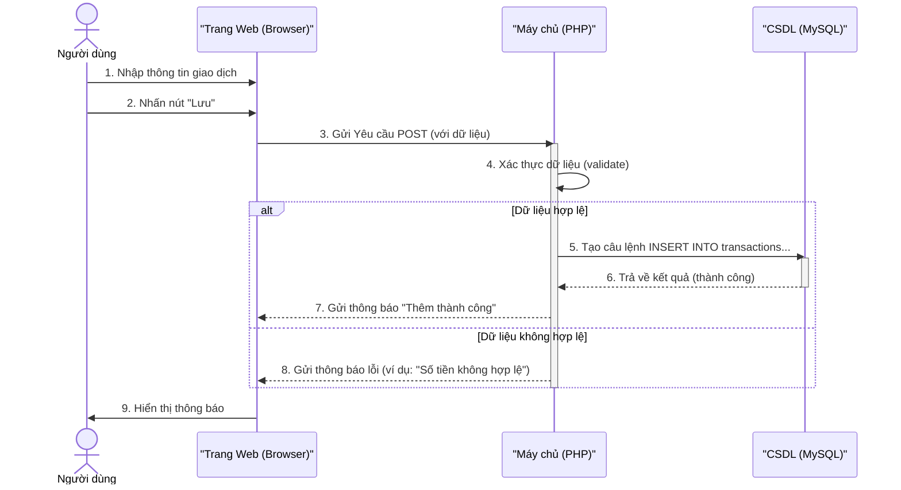

# 💰 Web App Quản lý Chi tiêu Cá nhân

<p align="center">
  
  
  
  
  
  
</p>

<p align="center">
  
  
</p>

---

## 📚 Mục lục
* [🌟 1. Mục tiêu và mô tả hệ thống](#-1-mục-tiêu-và-mô-tả-hệ-thống)
* [👥 2. Thông tin sinh viên](#-2-thông-tin-sinh-viên)
* [🧩 3. Chức năng chính (Functional Requirements)](#-3-chức-năng-chính-functional-requirements)
* [🧠 4. Yêu cầu phi chức năng (Non-functional Requirements)](#-4-yêu-cầu-phi-chức-năng-non-functional-requirements)
* [💻 5. Công nghệ sử dụng](#-5-công-nghệ-sử-dụng)
* [📐 6. Thiết kế cơ sở dữ liệu](#-6-thiết-kế-cơ-sở-dữ-liệu)
* [📊 7. Luồng hoạt động](#-7-luồng-hoạt-động)
* [🎯 8. Sơ đồ hệ thống](#-8-sơ-đồ-hệ-thống)
* [🚀 9. Cài đặt & chạy thử bằng Docker](#-9-cài-đặt--chạy-thử-bằng-docker)
* [💡 10. Ý tưởng mở rộng](#-10-ý-tưởng-mở-rộng)
* [🧾 11. Yêu cầu nộp bài (Môn học)](#-11-yêu-cầu-nộp-bài-môn-học)

---

## 🌟 1. Mục tiêu và mô tả hệ thống
Dự án này là một ứng dụng web giúp người dùng quản lý chi tiêu cá nhân một cách hiệu quả.

Ứng dụng cho phép người dùng:
* Ghi lại thu nhập và chi tiêu hàng ngày.
* Phân loại chi tiêu (ăn uống, đi lại, giải trí…).
* Xem báo cáo tổng hợp theo ngày / tháng / danh mục.
* Quản lý tài khoản cá nhân (đăng ký / đăng nhập).

---

## 👥 2. Thông tin sinh viên
- Họ và tên: **Cao Nguyễn Anh Sơn**
- MSSV: **B24DTCN496**
- Lớp: **D24TXCN12-B**

---

## 🧩 3. Chức năng chính (Functional Requirements)
| Nhóm chức năng              | Mô tả                                                                      |
| :-------------------------- | :------------------------------------------------------------------------- |
| **Đăng ký / Đăng nhập**     | Người dùng tạo tài khoản, đăng nhập để xem dữ liệu riêng của mình.         |
| **Ghi thu / chi**           | Thêm, sửa, xóa các khoản thu hoặc chi tiêu (CRUD).                         |
| **Phân loại danh mục**      | Mỗi khoản thuộc một danh mục như: Ăn uống, Di chuyển, Hóa đơn, Lương, v.v. |
| **Báo cáo và thống kê**     | Tổng hợp thu/chi theo ngày, tuần, tháng, hoặc theo danh mục.               |
| **Biểu đồ trực quan**       | Hiển thị bằng biểu đồ cột hoặc tròn (sử dụng Chart.js).                    |
| **Xuất báo cáo (optional)** | Cho phép tải file CSV hoặc PDF thống kê chi tiêu.                          |

---

## 🧠 4. Yêu cầu phi chức năng (Non-functional Requirements)
* **Giao diện:** Thân thiện, dễ thao tác (responsive nếu có thể).
* **Bảo mật:** Dữ liệu chỉ hiển thị cho đúng người dùng (mật khẩu được hash).
* **Lưu trữ:** Dữ liệu lưu trữ ổn định (MySQL).
* **Triển khai:** Có thể triển khai bằng Docker trên môi trường local hoặc server nhỏ.

---

## 💻 5. Công nghệ sử dụng
* **Frontend:** HTML, CSS, JavaScript, Bootstrap
* **Backend:** PHP (thuần hoặc Laravel)
* **Database:** MySQL
* **Library:** Chart.js (để vẽ biểu đồ)
* **Containerization:** Docker, Docker Compose

---

## 📐 6. Thiết kế cơ sở dữ liệu
**Bảng `users`:**
```sql
CREATE TABLE users (
  id INT PRIMARY KEY AUTO_INCREMENT,
  username VARCHAR(50) NOT NULL UNIQUE,
  password VARCHAR(255) NOT NULL,
  email VARCHAR(100)
);
```

**Bảng `categories`:**
```sql
CREATE TABLE categories (
  id INT PRIMARY KEY AUTO_INCREMENT,
  name VARCHAR(100) NOT NULL,
  type ENUM('income', 'expense') NOT NULL
);
```

**Bảng `transactions`:**
```sql
CREATE TABLE transactions (
  id INT PRIMARY KEY AUTO_INCREMENT,
  user_id INT,
  category_id INT,
  amount DECIMAL(10, 2) NOT NULL,
  date DATE NOT NULL,
  note TEXT,
  FOREIGN KEY (user_id) REFERENCES users(id),
  FOREIGN KEY (category_id) REFERENCES categories(id)
);
```

---

## 📊 7. Luồng hoạt động
1. Người dùng Đăng ký tài khoản.
2. Người dùng Đăng nhập vào hệ thống.
3. Trang Dashboard hiển thị tổng quan (ví dụ: tổng chi tiêu tháng này).
4. Người dùng chọn Thêm giao dịch mới (nhập số tiền, chọn danh mục, ghi chú).
5. Dữ liệu được lưu vào CSDL MySQL.
6. Người dùng truy cập trang Báo cáo.
7. Hệ thống đọc dữ liệu từ CSDL và hiển thị biểu đồ (sử dụng Chart.js).

---

## 🎯 8. Sơ đồ hệ thống

### 8.1 Use Case Diagram
```mermaid
useCaseDiagram
    actor User as "Người dùng"

    rectangle "Hệ thống Quản lý Chi tiêu" {
        User -- (Đăng ký tài khoản)
        User -- (Đăng nhập hệ thống)
        User -- (Đăng xuất)
        User -- (Quản lý Giao dịch)
        User -- (Xem Báo cáo)

        (Quản lý Giao dịch) ..> (Thêm Giao dịch) : <<include>>
        (Quản lý Giao dịch) ..> (Sửa Giao dịch) : <<include>>
        (Quản lý Giao dịch) ..> (Xóa Giao dịch) : <<include>>

        (Xem Báo cáo) ..> (Xem biểu đồ) : <<extend>>
        (Xem Báo cáo) ..> (Xuất file CSV) : <<extend>>
    }
```

### 8.2 ERD Diagram
```mermaid
erDiagram
    users {
        int id PK "Khóa chính"
        varchar(50) username "Tên đăng nhập (duy nhất)"
        varchar(255) password "Mật khẩu (hashed)"
        varchar(100) email "Email"
    }

    categories {
        int id PK "Khóa chính"
        varchar(100) name "Tên danh mục"
        ENUM('income', 'expense') type "Loại (thu/chi)"
    }

    transactions {
        int id PK "Khóa chính"
        int user_id FK "Khóa ngoại (users)"
        int category_id FK "Khóa ngoại (categories)"
        decimal(10,2) amount "Số tiền"
        date date "Ngày giao dịch"
        text note "Ghi chú"
    }

    users ||--o{ transactions : "có"
    categories ||--o{ transactions : "thuộc"
```

### 8.3 Activity Diagram

```mermaid
activityDiagram
    start
    :Người dùng nhấn nút "Thêm Giao dịch";
    :Hệ thống hiển thị Form Nhập liệu;
    :Người dùng nhập (Số tiền, Danh mục, Ngày, Ghi chú);
    :Người dùng nhấn "Lưu";
    if (Dữ liệu có hợp lệ không?) then (Có)
        :Hệ thống lưu thông tin vào CSDL (Bảng 'transactions');
        :Hiển thị thông báo "Thêm thành công";
        :Chuyển về trang Dashboard;
    else (Không)
        :Hiển thị thông báo lỗi (Ví dụ: "Vui lòng nhập số tiền");
        :Giữ người dùng ở lại Form Nhập liệu;
    endif
    stop
```

### 8.4 Sequence Diagram



---

## 🚀 9. Cài đặt & chạy thử bằng Docker

**Clone repository:**

```bash
git clone https://github.com/caosoncourse-del/Expense-management.git
cd Expense-management
```

**Cấu hình Docker (docker-compose.yml):**

```yaml
version: '3.8'
services:
  web:
    image: php:8.2-apache
    container_name: php_app
    ports:
      - "8080:80"
    volumes:
      - ./:/var/www/html/
    depends_on:
      - db
  db:
    image: mysql:8.0
    container_name: mysql_db
    restart: always
    environment:
      MYSQL_ROOT_PASSWORD: root123
      MYSQL_DATABASE: personal_finance
      MYSQL_USER: user
      MYSQL_PASSWORD: pass123
    ports:
      - "3306:3306"
    volumes:
      - db_data:/var/lib/mysql
volumes:
  db_data:
```

**Khởi động Docker:**

```bash
docker-compose up -d
```

**Cấu hình kết nối database (ví dụ file .env hoặc config):**

```php
DB_HOST = 'db';
DB_NAME = 'personal_finance';
DB_USER = 'user';
DB_PASS = 'pass123';
```

**Truy cập ứng dụng:**

* Mở trình duyệt: `http://localhost:8080`

---

## 💡 10. Ý tưởng mở rộng

* Thêm chức năng đặt Mục tiêu tiết kiệm (Saving Goal).
* Cảnh báo nếu chi tiêu vượt hạn mức đã đặt.
* Nâng cao chức năng báo cáo: Lọc theo khoảng thời gian hoặc tìm kiếm theo ghi chú.
* Phát triển API RESTful để mở rộng lên ứng dụng Mobile (Android/iOS).

---

## 🧾 11. Yêu cầu nộp bài (Môn học)

Các tài liệu cần thiết khi nộp báo cáo môn "Nhập môn Công nghệ phần mềm":

* Bảng yêu cầu chức năng (FR) và phi chức năng (NFR).
* Sơ đồ Use Case.
* Sơ đồ hoạt động (Activity Diagram) hoặc Sơ đồ trình tự (Sequence Diagram) cho các chức năng chính.
* Sơ đồ ERD (Entity Relationship Diagram).
* Mô tả kiến trúc hệ thống (Frontend-Backend-Database).
* Ảnh chụp giao diện demo hoặc prototype (Figma).
* Nhật ký nhóm, phân công công việc, kế hoạch tiến độ (tùy yêu cầu GV).

